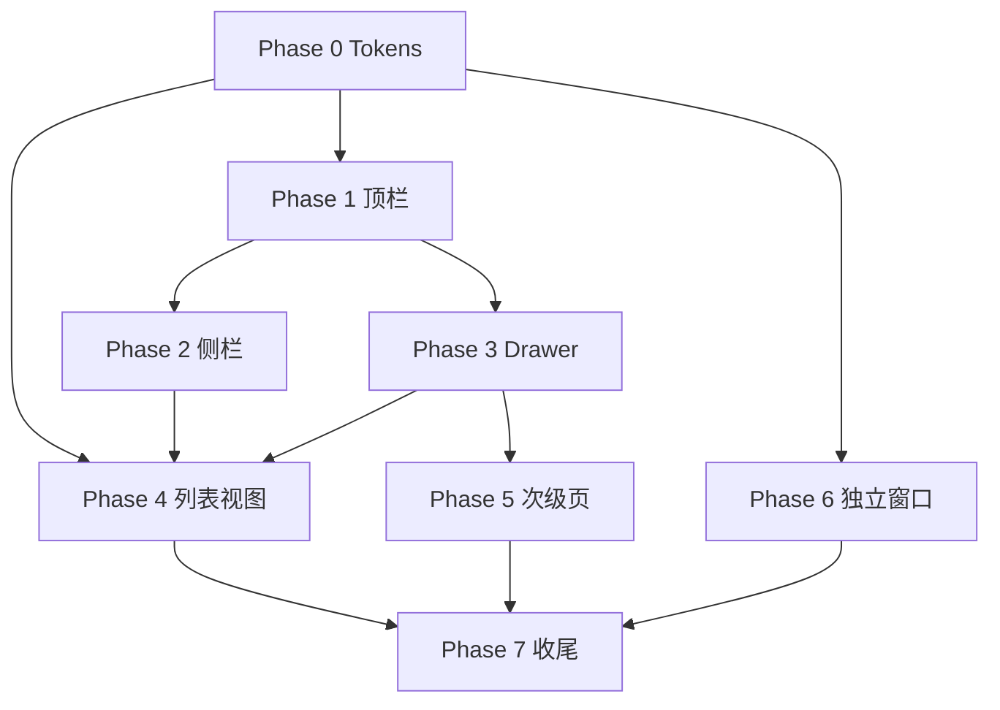

# 桌面端重设计实施计划

> **依据**：[`DESIGN.md`](../DESIGN.md) · [`设计/桌面端`](../../设计/桌面端) · [`pages-overview.md`](./pages-overview.md)  
> **原则**：先文档、后分阶段落地；每阶段可独立验收、可回滚；不改动数据层与 IPC 契约（除非阶段内明确列出）。

---

## 1. 目标与范围

### 1.1 要达成什么

将现网桌面端 UI **渐进对齐** TodoMaster 高保真图与交互圣经，核心体验：

| 体验 | 目标态 |
|------|--------|
| 布局 | 顶栏 56px + 侧栏 240px + 工作区 + 右侧详情 Drawer |
| 交互 | 点任务不跳路由；新建/详情用 Drawer；消息 Popover |
| 视觉 | 白底 + `#1677FF` 主色 + Inter；P0–P3 语义徽章 |
| 数据 | **不变** — 仍用现有 `task-store` / SQLite / IPC |

### 1.2 不在本计划内（避免范围膨胀）

- 后端 / quick-h5 同步改版
- 新增业务字段或数据库迁移
- 账号体系、多用户头像（顶栏用户区先用占位/本地昵称）
- 任务模板、关联项目、负责人头像（图稿 `de269ef6` 中的 PM 字段，后续单独立项）
- 全局搜索的后端全文索引优化（先做 UI + 现有列表过滤）

### 1.3 现网 vs 目标 — 差距摘要

| 模块 | 现网 | 目标 | 差距等级 |
|------|------|------|----------|
| 全局顶栏 | 无 | 搜索 + 新建 + 通知 + 主题 + 用户 | **大** |
| 侧栏 | 52px rail + 220px panel（≈272px） | 240px 单栏信息架构 | **大** |
| 详情面板 | 400px，可展开 720px；支持 dialog | 420–480px 并排 Drawer | **中** |
| 主题 | Claude 暖色 + 7 套品牌 + 衬线标题 | 白底蓝主色 + sans | **中** |
| 列表行 | 字段较多、样式旧 | 轻量两行 + P 徽章 | **中** |
| 看板/四象限 | 功能已有 | 列宽/配色/卡片轻量 | **小** |
| 收件箱/已完成/垃圾桶 | 功能已有 | 布局与文案抛光 | **小** |
| 快捷捕获/挂件 | 独立窗口已有 | 视觉与流程微调 | **小** |
| 日历详情 | fixed + 遮罩 | 与 Home 一致并排 Drawer | **中** |
| Ctrl+K | 聚焦快捷添加 | 聚焦全局搜索 | **中**（需产品确认） |

---

## 2. 阶段总览

```text
Phase 0  Design Tokens 基础     ← 风险最低，建议先做
Phase 1  全局顶栏 AppTopBar
Phase 2  侧栏信息架构重组
Phase 3  详情 / 新建 Drawer 统一
Phase 4  任务列表与工作区视图
Phase 5  次级页面与消息 / 设置
Phase 6  独立窗口（捕获 / 挂件）
Phase 7  收尾、文档与回归
```

**建议迭代顺序**：0 → 1 → 2 → 3 → 4 → 5 → 6 → 7  
每阶段结束：本地 `pnpm dev` 手测 + 勾选 §6 验收清单。

---

## 3. 分阶段详细说明

### Phase 0 — Design Tokens 与主题基础

**目标**：建立目标视觉变量，不破坏现有 7 套品牌主题；新用户默认走 `todoMaster` 主题。

| 任务 ID | 内容 | 主要文件 |
|---------|------|----------|
| P0-1 | 在 `desktop.scss` 增加 `--desktop-primary*`、语义色、优先级色 CSS 变量 | `src/styles/desktop.scss` |
| P0-2 | 新增主题预设 `todoMaster`（白底蓝主色、Inter、无衬线标题） | `src/utils/theme-preferences.ts` |
| P0-3 | 默认主题改为 `todoMaster`；设置页「外观」保留旧主题 | `theme-preferences.ts`、`SettingsThemeSection.vue` |
| P0-4 | 抽取 `PriorityBadge.vue`（P0–P3 代号 + 语义标签 + 色板） | **新建** `src/components/PriorityBadge.vue` |
| P0-5 | 标题字体：`.home__view-title` 等改用 sans（todoMaster 下） | `desktop.scss` |
| P0-6 | Element Plus 主色映射 `--el-color-primary` → `--desktop-primary` | `theme-preferences.ts` |

**验收**

- [x] 切换「外观 → TodoMaster」后全局白底蓝按钮
- [x] 旧主题 Claude/Notion 等仍可切换且不破版
- [x] `PriorityBadge` 在 Story/临时页或列表中可渲染四种优先级

**风险**：低。纯样式与组件抽取。

---

### Phase 1 — 全局顶栏 `AppTopBar`

**目标**：补齐 DESIGN §3.2 顶栏；将分散操作收敛到顶栏。

| 任务 ID | 内容 | 主要文件 |
|---------|------|----------|
| P1-1 | 新建 `AppTopBar.vue`：Logo、搜索框、+新建、通知、主题、用户区 | **新建** `src/components/AppTopBar.vue` |
| P1-2 | 新建 `GlobalSearch.vue`（或 composable）：搜索任务标题/描述/标签；下拉结果 | **新建** `src/components/GlobalSearch.vue` |
| P1-3 | 在 `App.vue` 或共享布局壳中挂载顶栏（Home + Calendar 共用；Settings 可选） | `App.vue` 或新建 `AppShell.vue` |
| P1-4 | `+ 新建任务` 触发新建 Drawer（Phase 3 前可先 `emit` 到 HomeView） | `AppTopBar.vue`、`HomeView.vue` |
| P1-5 | 通知铃铛迁入顶栏；侧栏铃铛保留但行为同源 | `AppTopBar.vue`、`AppSidebar.vue` |
| P1-6 | 快捷键：`Ctrl+K` 聚焦全局搜索；`Ctrl+N` 保持新建 | `useDesktopActions.ts` |
| P1-7 | 顶栏高度 56px；工作区 `height: calc(100vh - 56px)` | 布局 SCSS |

**布局结构（目标）**

```text
App.vue
├── AppTopBar (56px)
└── .app__body (flex row)
    ├── AppSidebar
    └── router-view (HomeView / CalendarView / SettingsView)
```

**验收**

- [x] 顶栏在三页（Home/Calendar/Settings）表现一致或按设计省略
- [x] `Ctrl+K` 打开/聚焦搜索；输入可搜到任务并跳转打开详情
- [x] `Ctrl+N` 仍可新建
- [x] 通知 Popover 宽 ≈360px，Tab 与现网一致

**风险**：中。涉及布局壳重构，需回归 Calendar/Settings 高度。

**产品决策（已默认）**

- `Ctrl+K` = 全局搜索（DESIGN 口径）；快捷添加仍保留在列表顶，不占 `Ctrl+K`。

---

### Phase 2 — 侧栏信息架构重组

**目标**：对齐 DESIGN §3.3 导航结构；宽度 240px；分区：工作台 / 效率工具 / 系统。

| 任务 ID | 内容 | 主要文件 |
|---------|------|----------|
| P2-1 | 侧栏改为**单栏 240px**（移除 52+220 双轨，或双轨折叠后等价 64px） | `AppSidebar.vue` |
| P2-2 | 导航分组：全部任务、收件箱、最近7天、已完成、垃圾桶 | 同上 |
| P2-3 | 「我的视图」可折叠区块 + 新建视图入口 | 同上 |
| P2-4 | 「我的清单」可折叠 + 色点 + 计数 + 拖拽排序 | 同上 |
| P2-5 | 分隔线后：日历、四象限、定时汇总（路由/query 保持现网） | 同上 |
| P2-6 | 底部：消息、设置（消息打开顶栏同源 Popover） | 同上 |
| P2-7 | 清单/视图右键菜单：编辑、复制、新建任务、排序、删除 | 同上或抽 `SidebarContextMenu` |
| P2-8 | 可选：折叠态 64px 仅图标 | 同上 |

**与现网行为映射**

| DESIGN 项 | 现网 query / 事件 |
|-----------|-------------------|
| 全部任务 | `selectSmart('all')` |
| 收件箱 | `view=inbox` |
| 最近 7 天 | smart week / 自定义视图 |
| 已完成 | `view=done` |
| 垃圾桶 | `view=trash` |
| 日历 | `router.push('/calendar')` 或侧栏 emit |
| 四象限 | `view=matrix` |
| 定时汇总 | `view=summary` |

**验收**

- [ ] 侧栏宽 240px（±8px）
- [ ] 分组标题与分隔线与图稿一致
- [ ] 点击各项过滤行为与改版前一致
- [ ] 清单拖拽排序仍有效

**风险**：中高。`AppSidebar` 1000+ 行，建议拆子组件：`SidebarWorkbench.vue`、`SidebarTools.vue`、`SidebarSystem.vue`。

---

### Phase 3 — 详情 / 新建 Drawer 统一

**目标**：对齐 DESIGN §5.2、§5.3、§6；消灭「弹框详情」默认路径。

| 任务 ID | 内容 | 主要文件 |
|---------|------|----------|
| P3-1 | `TaskDetailPanel` 默认宽 420px，最大 480px；移除 720px 展开或改为可选 | `TaskDetailPanel.vue`、`HomeView.vue` |
| P3-2 | 详情与列表**并排**（flex），非 absolute 浮层压盖（Home） | `HomeView.vue` SCSS |
| P3-3 | 列表 pane `min-width: 360px` | `HomeView.vue` |
| P3-4 | `CalendarView` 详情改为与 Home 相同并排模式，去掉全屏 scrim | `CalendarView.vue` |
| P3-5 |  deprecate `taskDetailStyle=dialog`：设置项隐藏或迁移提示 | `TaskListViewMenu.vue`、`view-display-preferences.ts` |
| P3-6 | 详情区块折叠：安排 / 子任务 / 附件默认折叠 | `TaskDetailPanel.vue` |
| P3-7 | 详情 Tab：详情 \| 动态（活动记录归动态 Tab） | 同上 |
| P3-8 | 新建任务统一右侧 Drawer（复用 `TaskDetailPanel` 创建态或 `TaskCreateDrawer.vue`） | `HomeView.vue`、新建组件 |
| P3-9 | 顶栏「+ 新建」、列表 `Ctrl+N`、看板列底统一走新建 Drawer | 多文件 |

**验收**

- [ ] 打开详情时列表仍可见且可滚动
- [ ] 详情宽 420–480px
- [ ] 日历页点击任务行为与 Home 一致
- [ ] 新建不跳转、不弹居中 Modal
- [ ] 折叠区默认收起，有子任务时可自动展开子任务区

**风险**：中。`TaskDetailPanel` 体量大，折叠与 Tab 需小心回归编辑保存逻辑。

---

### Phase 4 — 任务列表与工作区视图

**目标**：对齐 DESIGN §5.1、§5.4–§5.9 的视觉与信息密度。

| 任务 ID | 内容 | 主要文件 |
|---------|------|----------|
| P4-1 | `TaskList` 行：勾选 + `PriorityBadge` + 标题 + meta 行 | `TaskList.vue` |
| P4-2 | 选中行背景 `--desktop-primary-light` | 同上 |
| P4-3 | 分组头样式：`今天 · 9 个` | 同上 |
| P4-4 | `QuickAddInput`：placeholder 含自然语言提示；右侧 `Ctrl+N` 角标 | `QuickAddInput.vue` |
| P4-5 | 列表头：标题区保留；筛选/排序/分组与 DESIGN 文案对齐 | `HomeView.vue`、`TaskListViewMenu.vue` |
| P4-6 | `TaskKanbanView`：列宽 280px；卡片轻量边框；列底 `+ 添加任务` | `TaskKanbanView.vue` |
| P4-7 | `QuadrantMatrixView`：四象限背景色 + P 语义标题 | `QuadrantMatrixView.vue` |
| P4-8 | `TaskTimelineView`：行高 40px、条带 24px | `TaskTimelineView.vue` |
| P4-9 | `InboxView`：快速记录 → 便签网格 → 待处理任务 | `InboxView.vue` |
| P4-10 | `CompletedTaskList`：本周统计 + 今天/本周/本月筛选 | `CompletedTaskList.vue` |
| P4-11 | `TrashTaskList`：极简 + 恢复/彻底删除 | `TrashTaskList.vue` |

**验收**

- [ ] 列表行最多两行信息，无多余字段外露
- [ ] 优先级显示「P1 重要」形式
- [ ] 看板列宽 280px
- [ ] 四象限配色与 DESIGN §4.1 一致
- [ ] 收件箱三区结构清晰

**风险**：中。`TaskList.vue` 改动面大，注意虚拟滚动/拖拽若存在。

---

### Phase 5 — 次级页面、消息与设置

**目标**：日历、汇总、设置、视图编辑器抛光。

| 任务 ID | 内容 | 主要文件 |
|---------|------|----------|
| P5-1 | `CalendarView`：月格色点/色条、底部分类图例 | `calendar/*.vue` |
| P5-2 | `AppMessagePanel` 宽 360px；顶栏触发为主 | `AppMessagePanel.vue` |
| P5-3 | `SettingsView` 左 nav 240px；与 DESIGN 子页列表对齐 | `SettingsView.vue` |
| P5-4 | `TaskViewEditor` 可视化条件 UI 抛光（字段+运算符+值行） | `TaskViewEditor.vue` |
| P5-5 | 定时汇总：编辑流程分步（若现网为单页，拆向导） | `settings/SettingsSummarySection.vue` 等 |
| P5-6 | `SummaryResultsView` 列表样式统一 token | `SummaryResultsView.vue` |

**验收**

- [ ] 日历点击任务打开并排详情（Phase 3 依赖）
- [ ] 设置页左栏宽 240px
- [ ] 视图编辑器可读性明显提升

**风险**：低–中。汇总分步可能触及较多表单逻辑。

---

### Phase 6 — 独立窗口（捕获 / 挂件）

**目标**：DESIGN §5.13、§5.14；与主应用视觉区分但 token 一致。

| 任务 ID | 内容 | 主要文件 |
|---------|------|----------|
| P6-1 | `capture` 浮窗：紧凑布局、识别中/预览两态 | `capture/QuickCaptureApp.vue`、`capture.scss` |
| P6-2 | 保存后进入收件箱（确认现网逻辑，不足则补） | capture 主进程/IPC |
| P6-3 | `widget` 便签/四象限/视图：紧凑卡片 | `widget/*.vue`、`widget.scss` |

**验收**

- [ ] `Ctrl+Shift+Space` 唤起捕获窗
- [ ] 挂件与主应用风格协调但不完全复制三栏布局

**风险**：低。

---

### Phase 7 — 收尾、文档与回归

| 任务 ID | 内容 | 主要文件 |
|---------|------|----------|
| P7-1 | 更新 `desktop/README.md` 截图说明与快捷键表 | `README.md` |
| P7-2 | `pages-overview.md` 增加指向 `DESIGN.md`、本计划链接 | `docs/pages-overview.md` |
| P7-3 | 清理废弃样式（dialog 详情、旧侧栏 rail 等） | 多文件 |
| P7-4 | 全量手测清单（§6） | — |
| P7-5 | 可选：补充关键组件单测（PriorityBadge、主题变量） | `*.test.ts` |

---

## 4. 文件影响矩阵（按阶段）

| 文件 | P0 | P1 | P2 | P3 | P4 | P5 | P6 |
|------|:--:|:--:|:--:|:--:|:--:|:--:|:--:|
| `styles/desktop.scss` | ✓ | ✓ | ✓ | ✓ | ✓ | | ✓ |
| `utils/theme-preferences.ts` | ✓ | | | | | ✓ | |
| `App.vue` / `AppShell.vue` | | ✓ | ✓ | | | | |
| `components/AppTopBar.vue` | | **新** | ✓ | | | | |
| `components/GlobalSearch.vue` | | **新** | | | | | |
| `components/AppSidebar.vue` | | ✓ | ✓ | | | | |
| `components/PriorityBadge.vue` | **新** | | | ✓ | ✓ | | |
| `views/HomeView.vue` | | ✓ | | ✓ | ✓ | | |
| `views/CalendarView.vue` | | ✓ | | ✓ | ✓ | ✓ | |
| `views/SettingsView.vue` | | ✓ | | | | ✓ | |
| `components/TaskDetailPanel.vue` | | | | ✓ | | | |
| `components/TaskList.vue` | | | | | ✓ | | |
| `components/TaskKanbanView.vue` | | | | | ✓ | | |
| `components/QuadrantMatrixView.vue` | | | | | ✓ | | |
| `composables/useDesktopActions.ts` | | ✓ | | | | | |

---

## 5. 依赖关系



**可并行**（人力足够时）：P6 与 P4/P5 并行；P0 完成后 P1 与 P4-1（PriorityBadge 接入）可部分并行。

---

## 6. 总体验收清单（回归用）

### 布局与导航

- [ ] 窗口 ≥1280×720 时三栏不挤扁
- [ ] 顶栏 56px + 侧栏 240px + 详情 420px 同时成立
- [ ] 侧栏全部入口可点击且路由/query 正确

### 任务核心流

- [ ] 快捷添加 / `Ctrl+N` / 顶栏新建 → 创建任务
- [ ] 自然语言解析创建（若已启用）→ 收件箱
- [ ] 列表点任务 → 右侧详情，不跳路由
- [ ] 详情编辑保存、删除、子任务、附件正常
- [ ] 看板拖拽改列；四象限拖拽改优先级

### 视图

- [ ] 列表 / 看板 / 时间轴切换正常
- [ ] 日历月/周/日切换；点任务开详情
- [ ] 收件箱 / 已完成 / 垃圾桶
- [ ] 自定义视图筛选生效

### 全局

- [ ] `Ctrl+K` 搜索；`Ctrl+Shift+Space` 捕获
- [ ] 消息 Popover；设置各子页可进
- [ ] 主题切换：TodoMaster 默认 + 旧主题可选
- [ ] 导入导出、快捷键设置未被破坏

---

## 7. 实施节奏建议

| 迭代 | 阶段 | 预估工作量 | 可交付物 |
|------|------|------------|----------|
| 第 1 次 PR | P0 + P1 | 中 | 新主题 + 顶栏 + 全局搜索 |
| 第 2 次 PR | P2 | 大 | 新侧栏 IA |
| 第 3 次 PR | P3 | 大 | Drawer 统一 |
| 第 4 次 PR | P4 | 大 | 列表/看板/四象限视觉 |
| 第 5 次 PR | P5 + P6 | 中 | 日历/设置/捕获/挂件 |
| 第 6 次 PR | P7 | 小 | 文档 + 清理 + 回归 |

---

## 8. 执行方式（与 AI 协作）

每次实施只做一个 Phase（或 Phase 内一个 P*-x 任务组）：

1. 声明：`按 redesign-implementation-plan Phase N 实施`
2. 实施前对照 [`DESIGN.md`](../DESIGN.md) 对应章节
3. 对照高保真图：`设计/桌面端/8a3c6830-….png`（主界面）、`c07ac7b1-….png`（多视图）、`de269ef6-….png`（表单）
4. 完成后勾选本文 §3 验收项 + §6 相关项
5. 不跨 Phase 顺手改无关文件

---

## 9. 文档索引

| 文档 | 路径 |
|------|------|
| 视觉与交互规范 | [`desktop/DESIGN.md`](../DESIGN.md) |
| 页面与字段清单 | [`desktop/docs/pages-overview.md`](./pages-overview.md) |
| 交互圣经 | [`设计/桌面端/设计.txt`](../../设计/桌面端/设计.txt) |
| 主界面效果图 | [`设计/桌面端/8a3c6830-443f-4416-a22b-2d7a4e75206e.png`](../../设计/桌面端/8a3c6830-443f-4416-a22b-2d7a4e75206e.png) |
| 多视图效果图 | [`设计/桌面端/c07ac7b1-7808-4e47-b02e-8527de5785ff.png`](../../设计/桌面端/c07ac7b1-7808-4e47-b02e-8527de5785ff.png) |
| 表单弹窗参考 | [`设计/桌面端/de269ef6-bbf4-4e4d-aa07-e980ab882bd3.png`](../../设计/桌面端/de269ef6-bbf4-4e4d-aa07-e980ab882bd3.png) |

---

*计划版本：v1.0 · 与 `DESIGN.md` 同步 · 实施时以本文任务 ID 跟踪进度*
